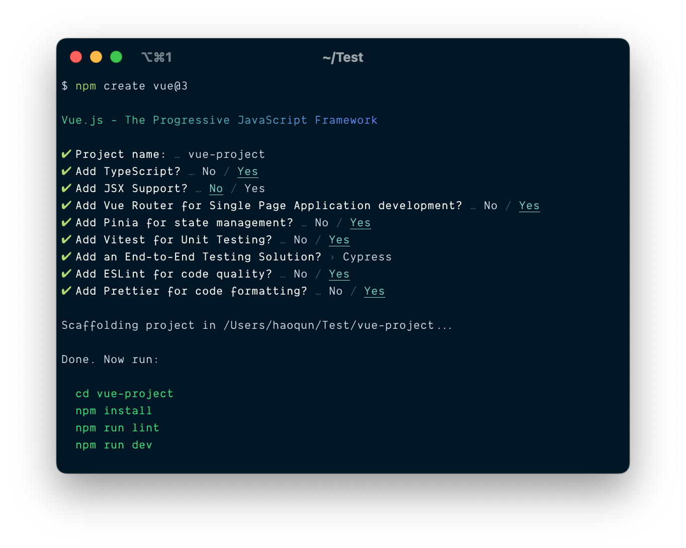

# create-vue

## create-vue 简单介绍

🛠️ The recommended way to start a Vite-powered Vue project

翻译成中文是：启动 Vite 驱动的 Vue 项目的推荐方法

你可以通过 `npm create vue@3`命令来快速搭建 Vue3 项目



> 用过 vite 的小伙伴可能还会知道用 vite 搭建项目，不过
> vite 搭建的项目需要安装对应的插件来解析 vue 文件。两者都可以快速搭建 vue 项目。

:::danger 注意
Vue 官方已经不推荐使用 vue-cli 搭建工程，只对 vue-cli 进行 bug 修复和维护工作，不会添加新的 feature
:::

## 从 package.json 开始

### 开发依赖 devDependencies

```json
{
  "devDependencies": {
    "@types/eslint": "^8.4.10",
    "@types/node": "^18.11.18",
    "@types/prompts": "^2.4.2",
    "@vue/create-eslint-config": "^0.1.3",
    "@vue/tsconfig": "^0.1.3",
    "esbuild": "^0.16.14",
    "esbuild-plugin-license": "^1.2.2",
    "husky": "^8.0.3",
    "kolorist": "^1.6.0",
    "lint-staged": "^13.1.0",
    "minimist": "^1.2.7",
    "npm-run-all": "^4.1.5",
    "prettier": "^2.8.1",
    "prompts": "^2.4.2",
    "zx": "^4.3.0"
  }
}
```

接下来，我会一一介绍每一个包是做什么的

- @types/eslint
- @types/node
- @types/prompts

以上三个以`@types`开头的包，都是 TypeScript 类型声明文件

- @vue/create-eslint-config
- @vue/tsconfig
- esbuild
- esbuild-plugin-license
- husky
- kolorist
- lint-staged
- minimist
- npm-run-all
- prettier
- prompts
- zx
